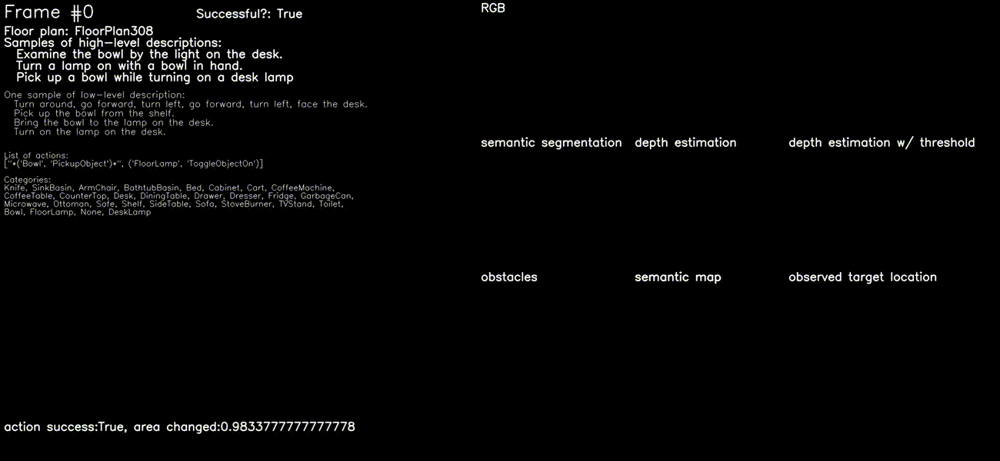

# Prompter: Utilizing Large Language Model Prompting for a Data Efficient Embodied Instruction Following

[Prompter: Utilizing Large Language Model Prompting for a Data Efficient Embodied Instruction Following](https://arxiv.org/abs/2211.03267)<br />
Yuki Inoue, Hiroki Ohashi<br />
Hitachi, Ltd.




## Setting up the environment

We use Docker for setting up the environment. If you do not plan on using Docker or have other issues, please also refer to [FILM](https://github.com/soyeonm/FILM)'s setup procedure for setting up the environment. Our code is a fork of FILM from commit ID fa4aefda700a58b54d78a7e8e996f7c977cdd045.

If you plan on not using Docker for setting environment, make sure that you are using **Python 3.6** and **AI2THOR ver. 2.1.0**.

### Basics

1. Clone the repo

   ```bash
   git clone ~
   ```

2. Create the docker image

   ```bash
   cd docker
   docker build -t prompter .
   ```

3. [Additional preliminaries to use ALFRED scenes](https://github.com/soyeonm/FILM#additional-preliminaries-to-use-alfred-scenes)

   - You will need to download alfred scene data and process it using the [alfred repo]().

   - The last step asks to create a soft link from `json_2.1.0` to `alfred_data_all`. However, in our experience we had to link from `alfred_feat_2.1.0`. The target folder is still the same, though (`json_2.1.0`).

     ```bash
     # before
     ln -s $ALFRED_ROOT/data/json_2.1.0 $FILM/alfred_data_all
     
     # after
     ln -s $ALFRED_ROOT/data/json_feat_2.1.0/ $FILM/alfred_data_all/json_2.1.0
     ```
     
   4. After this step, `alfred_data_all` directory should look like this:

      ```bash
   alfred_data_all
      └── json_2.1.0
       ├── tests_unseen
          ├── tests_seen
          ├── valid_unseen
          ├── tests_seen
          ├── trial_T2019...
          └── ...
      ```

4. [Download Trained models](https://github.com/soyeonm/FILM#download-trained-models)

   1. Download "Pretrained_Models_FILM" from [this link](https://drive.google.com/file/d/1mkypSblrc0U3k3kGcuPzVOaY1Rt9Lqpa/view?usp=sharing) kindly provided by FILM's author

   2. Relocate the downloaded models to the correct directories

      ```
      mv Pretrained_Models_FILM/maskrcnn_alfworld models/segmentation/maskrcnn_alfworld
      mv Pretrained_Models_FILM/depth_models models/depth/depth_models
      mv Pretrained_Models_FILM/new_best_model.pt models/semantic_policy/best_model_multi.pt
      ```

### Running with headless machines

Running ALFRED environment on headless machines is not straightforward, and it heavily depends on your hardware configuration. The root of the problem is that ALFRED is based on Unity, which requires some sort of display to operate properly. Unfortunately, headless machines do not have displays, so it must be substituted by a virtual display, which is not straightforward to set up.

We will introduce here what worked for us; please also refer to discussions in [FILM's repo](https://github.com/soyeonm/FILM), [ALFRED's repo](https://github.com/askforalfred/alfred), and [ALFRED worlds's repo](https://github.com/alfworld/alfworld) if it does not work for you.

1. You need to first run a Xserver with 

   ```
   sudo python alfred_utils/scripts/startx.py 0
   ```

   - The number after `startx.py` indicates the ID in which you will set up the virtual display. If something is already running on that ID, you will receive an error `Cannot establish any listening sockets - Make sure an X server isn't already running(EE)`. Try other numbers until you find the one that works.

   - If you set a Xdisplay other than 0 (if you ran `python alfred_utils/scripts/startx.py 1`, for example), set the environmental variable `DISPLAY` accordingly.

     ```
     export DISPLAY=:1
     ```

   - If you get an error: `Only console users are allowed to run the X server`, add the following line in `/etc/X11/Xwrapper.config`

     ```
     allowed_users = anybody
     ```

2. Check that the display is accessible

   ```
   glxinfo | grep rendering
   ```

3. Start another terminal session and run the following to evaluate the model. `--x_display` value must match the display ID you set in step 1. 

   ```bash
   python main.py -n1 --max_episode_length 1000 --num_local_steps 25 --num_processes 1 --eval_split valid_unseen --from_idx 0 --to_idx 510 --max_fails 10 --debug_local --learned_depth --use_sem_seg --set_dn testrun -v 0 --which_gpu 0 --x_display 0 --sem_policy_type mlm --mlm_fname mlmscore_equal --mlm_options aggregate_sum sem_search_all spatial_norm temperature_annealing new_obstacle_fn no_slice_replay --seed 1 --splits alfred_data_small/splits/oct21.json --grid_sz 240 --mlm_temperature 1 --approx_last_action_success --language_granularity high --centering_strategy local_adjustment --target_offset_interaction 0.5 --obstacle_selem 9 --debug_env
   ```

   - Do not enable `-v 1` on a headless machine.
   - This will run the evaluation on debug mode, which provides more readable error messages.
   - Details on the arguments for `main.py` is summarized [here](evaluation.md).


## Training / Evaluation

Prompter is based solely on pretrained models. No additional training is performed.

If you plan on retraining the pretrained models used in Prompter, please refer to [this link](https://github.com/soyeonm/FILM/tree/public#train-models-mask-rcnn--depth-bert-semantic-policy).

Evaluation and leaderboard submission is summarized in [this document](evaluation.md).


## Helpful links

- [List of Arguments for main.py](evaluation.md)
- [Debugging tips](debugging.md)
- [Obtaining MLM scores]() → coming soon


## Acknowledgements

Our codebase is heavily based on [So Yeon Min's FILM respository](https://github.com/soyeonm/FILM).

FILM repository borrows ideas from the following repositories:

- Most of [alfred_utils](https://github.com/soyeonm/FILM/control_helper/alfred_utils) comes from [Mohit Shridhar's ALFRED repository](https://github.com/askforalfred/alfred).
- [models/depth](https://github.com/soyeonm/FILM/tree/public/models/depth) comes from [Valts Blukis' HLSM](https://github.com/valtsblukis/hlsm).
- Code for semantic mapping comes from [Devendra Singh Chaplot's OGN](https://github.com/devendrachaplot/OGN)


If you plan on using this repository or take any ideas from it, please remember to cite our paper, *Prompter*, and Min et al's *FILM*, which Prompter was heavily influenced by.

#### Prompter

```
@article{inoue2022prompter,
  title={Prompter: Utilizing large language model prompting for a data efficient embodied instruction following},
  author={Inoue, Yuki and Ohashi, Hiroki},
  journal={arXiv preprint arXiv:2211.03267},
  year={2022}
}
```

#### FILM

```
@misc{min2021film,
      title={FILM: Following Instructions in Language with Modular Methods}, 
      author={So Yeon Min and Devendra Singh Chaplot and Pradeep Ravikumar and Yonatan Bisk and Ruslan Salakhutdinov},
      year={2021},
      eprint={2110.07342},
      archivePrefix={arXiv},
      primaryClass={cs.CL}
}
```

